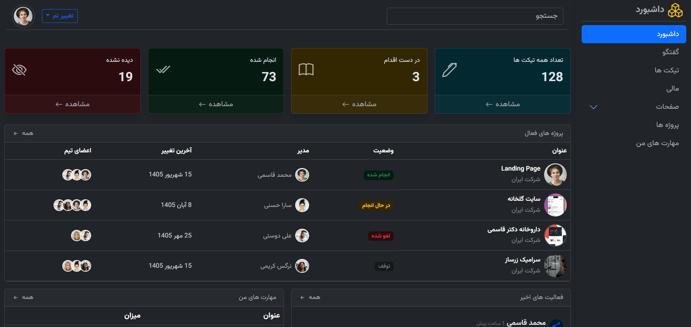

# 📊 Persian RTL Dashboard

A clean and responsive Persian **RTL dashboard interface** built as a front-end practice project using **HTML, CSS, Bootstrap, and Bootstrap Icons**.

The project focuses on building a realistic dashboard layout, working with Bootstrap components, creating responsive navigation, and adding a simple light/dark theme system.


## 🎯 About The Project

This project is a Persian RTL admin-style dashboard created as part of my front-end development learning journey.

The goal was to practice building a structured dashboard UI with Bootstrap while writing custom CSS where needed. The interface includes a desktop sidebar, responsive mobile navigation, dashboard statistics, project management data, recent activities, skill progress, profile actions, and theme switching.

## ✨ Features

- Fully **RTL** Persian interface
- Responsive layout for desktop, tablet, and mobile screens
- Desktop sidebar navigation
- Mobile sidebar using Bootstrap **Offcanvas**
- Dashboard statistics cards
- Active projects table with responsive overflow
- Recent activities section
- Skills section with progress indicators
- Profile dropdown with account actions
- Light / Dark theme switcher
- Theme preference persisted with **localStorage**
- Bootstrap accordion for nested sidebar pages
- Bootstrap Icons throughout the interface
- Persian typography using **Vazirmatn**
- Custom CSS for dashboard-specific styling

## 🛠️ Built With

- **HTML5**
- **CSS3**
- **Bootstrap 5.3.8 (RTL)**
- **Bootstrap Icons 1.13.1**
- **JavaScript** for theme switching and localStorage
- **Vazirmatn** font

## 📁 Folder Structure

```text
Dashboard-Bootstrap/
├── index.html
└── assets/
    ├── css/
    │   └── style.css
    └── imgs/
        ├── preview.png
        ├── photo-1.jpg
        ├── photo-2.jpg
        ├── photo-3.jpg
        ├── photo-5.jpg
        ├── photo-6.jpg
        ├── project-1.png
        ├── project-2.png
        ├── project-3.png
        ├── html.webp
        ├── css-icon.webp
        ├── Bootstrap_logo.svg.png
        └── javascript-logo-javascript-icon-transparent-free-png.webp
```

## 🚀 Live Demo

[View the live project on GitHub Pages](https://mohammadghasemi2025.github.io/Dashboard-Bootstrap/)

## 📸 Preview



## 📚 What I Practiced

This project helped me practice:

- Structuring a real-world dashboard with semantic HTML
- Using Bootstrap's grid and utility classes effectively
- Working with RTL layouts and Persian content
- Building responsive navigation for different screen sizes
- Combining Bootstrap components with custom CSS
- Managing a UI theme with JavaScript
- Persisting user preferences with `localStorage`
- Organizing assets and maintaining a clean project structure
- Using Git and GitHub through an incremental commit-based workflow

## 👨‍💻 Author

**Mohammad Ghasemi**

- GitHub: [@mohammadghasemi2025](https://github.com/mohammadghasemi2025)

---

Built with 💙 as part of my front-end development learning journey.
